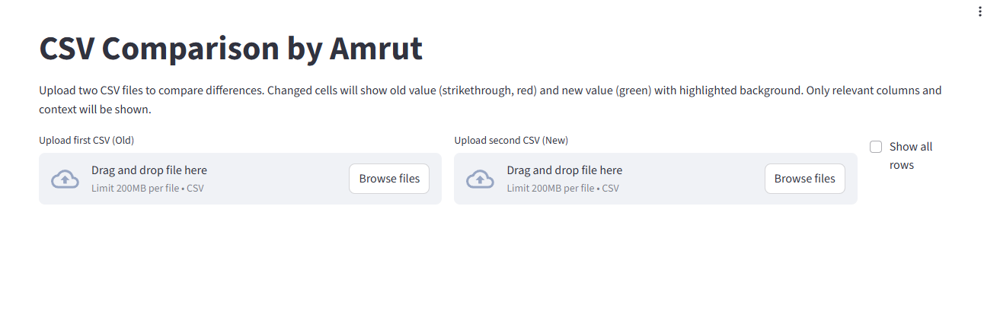
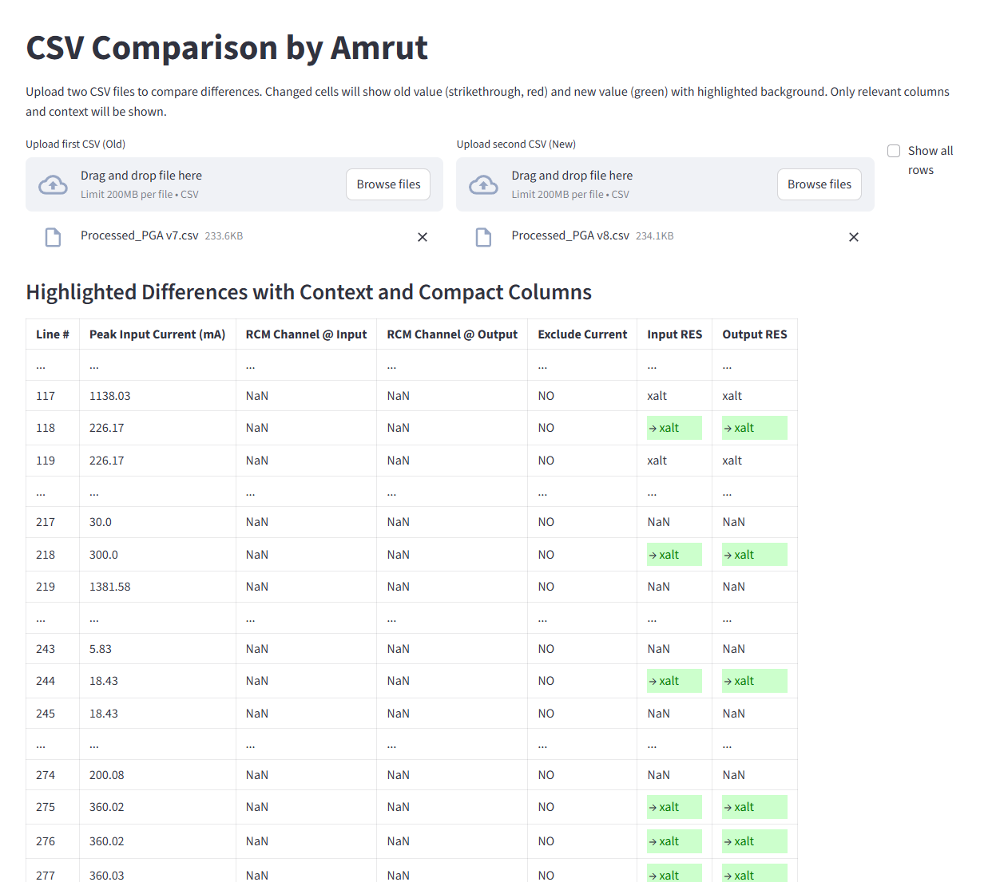

# CSV-comparator
Compare similar CSVs in web Interface. shows changes like in Github

## Usage
It uses streamlit python library 
can be hosted in a  Remote Desktop / VDesk.  
Download `app.py`. Run via `streamlit run app.py`

## Snapshots

